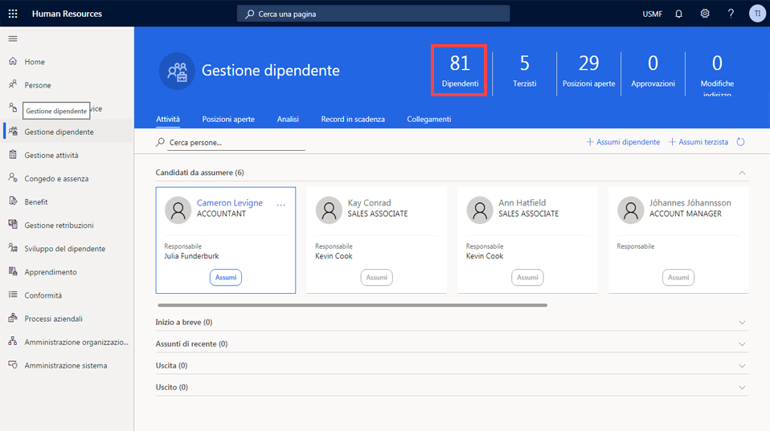

---
demo:
    title: 'Demo 1: Assegnazione di corsi di formazione'
    module: 'Modulo 4: Concetti fondamentali su Microsoft Dynamics 365 Human Resources'
---

## Demo 1: Assegnazione di corsi di formazione

1. Passare alla home page **Microsoft Dynamics 365 Human Resources**.  
    In Microsoft Dynamics 365 Human Resources i manager del personale possono assegnare corsi di formazione ai dipendenti. In questo esempio alla neoassunta Alicia della società deve essere assegnata la formazione disponibile per i dipendenti entro i primi trenta giorni.

1. Nella selezione della società in alto a destra verificare che la società cui si è connessi sia **USMF**. In caso contrario, modificare la società in **USMF**.

1. Nell'angolo in alto a sinistra dello schermo selezionare la scheda **Gestione dipendenti**.

1. Sul lato destro della pagina **Gestione dipendenti** fare clic sul numero appena sopra la parola **Dipendenti**.

    

1. Nella tabella **Dipendenti** selezionare il nome del dipendente cui assegnare la formazione. Ad esempio, **Alicia Thornber**.  
    Usare quindi la scheda Competenze e sviluppo per visualizzare i collegamenti alle informazioni su certificati, formazione e competenze di un dipendente.

1. Nella pagina del dipendente selezionare la scheda **Competenze e sviluppo**.

1. Nella sezione **Competenze** selezionare **Corsi**.  
    Dalla pagina Corsi di un dipendente è possibile verificare se sono stati assegnati corsi. Nel caso di Alicia, non è indicato alcun corso. Per visualizzare i corsi disponibili da assegnare, è necessario selezionare il menu ID corso.

1. Selezionare il menu **ID corso**.

1. Nella tabella Corsi selezionare il menu **ID corso**.

1. Nel menu **ID corso** selezionare il menu **Stato corso**.

1. Nel menu **Stato corso** selezionare la casella **Stato corso è esattamente**.  
    Può quindi essere necessario modificare il filtro **ID corso** applicato, ad esempio per visualizzare solo i corsi aperti.

1. Nella casella **Stato corso è esattamente** immettere **Aperto**.

1. Nel menu **Stato corso** selezionare **Applica** per visualizzare tutti i corsi aperti disponibili.  
    È ora possibile assegnare il corso di formazione per i neoassunti ad Alicia.

1. Selezionare il corso che si vuole assegnare. Ad esempio, **00006 New Hire Training**.

1. Nel riquadro Trasferire i dati del corso? selezionare **Sì**.

1. Nella pagina **Corsi** selezionare l'**icona del calendario** nella colonna **Data di inizio**.

1. Nel calendario selezionare la data di inizio. Ad esempio, **5 gennaio 2021**.

1. Nella colonna **Data di fine** selezionare l'**icona del calendario**.

1. Nel calendario selezionare la data di fine per la formazione. Ad esempio, **8 gennaio 2021**.

1. Sul lato sinistro della pagina **Corsi** selezionare **Salva** per salvare le modifiche.

1. Sul lato destro della pagina **Corsi** selezionare la **X** per chiudere la pagina.  
    Se è necessario modificare qualsiasi corso assegnato, selezionare di nuovo Corsi.

1. Nella pagina del **dipendente** selezionare **Corsi** nella sezione **Competenze**.

1. Nella pagina **Corsi** sulla barra di spostamento selezionare **Modifica** per apportare modifiche.

1. Nella colonna **Data di inizio** selezionare l'**icona del calendario**.

1. Selezionare la nuova data di inizio per il corso. Ad esempio, **6 gennaio 2021**.

1. Selezionare **Salva**.

1. Selezionare l'icona **X** per chiudere la pagina.

1. Nella pagina del **dipendente** selezionare l'icona **X** per chiudere la pagina.
