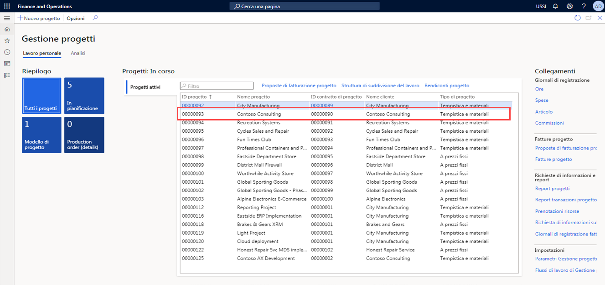
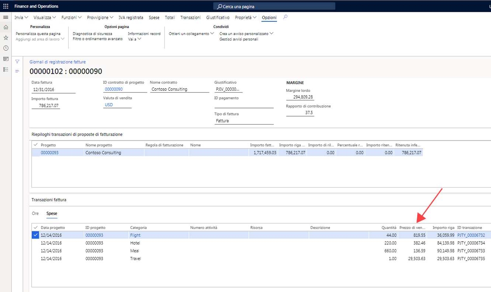
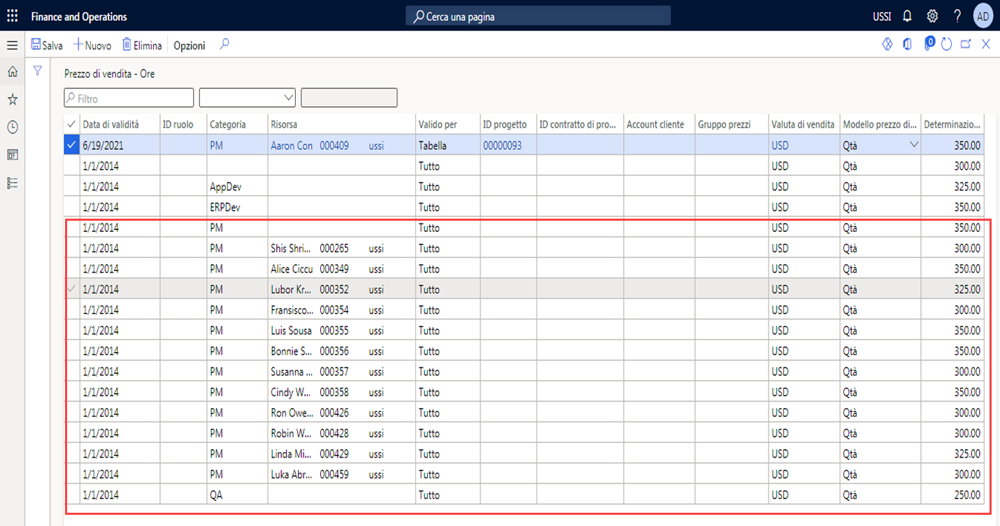
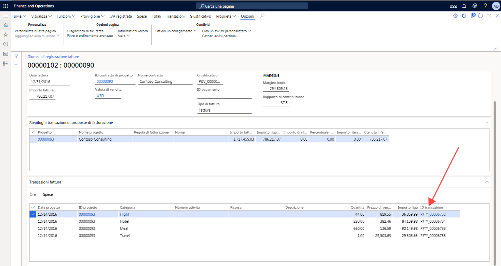
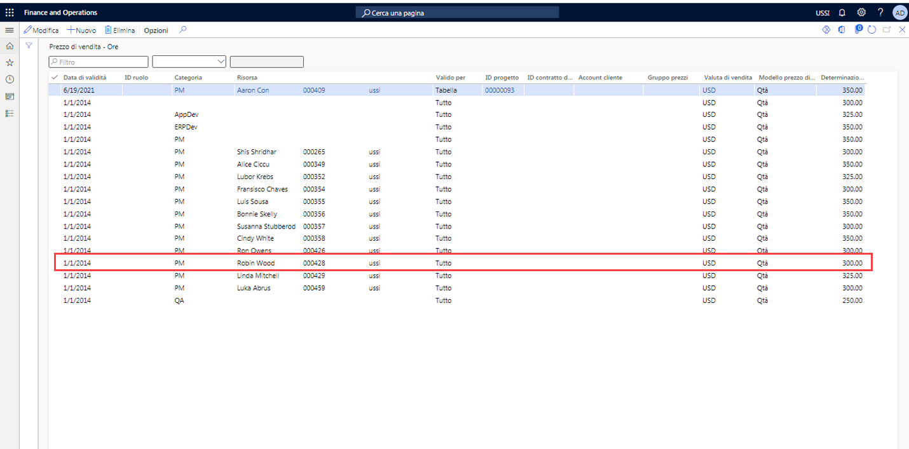

---
demo:
    title: 'Demo 1: Determinazione dei prezzi in Project Operations'
    module: 'Modulo 5: Concetti fondamentali su Microsoft Dynamics 365 Project Operations'
---

## Demo 1: Determinazione dei prezzi in Project Operations

1. Passare all'area di lavoro **Gestione progetti**.  
    In questa demo si imposteranno i prezzi di vendita e di costo in Project Operations. Si osserverà inoltre in che modo i costi e i prezzi vengono derivati da una fattura precedentemente registrata.

1. Nella selezione della società in alto a destra verificare che la persona giuridica cui si è connessi sia **USSI**.  
    In caso contrario, modificare l'organizzazione in **USSI**.

1. Nella tabella **Progetti attivi** selezionare il progetto **00000093 Contoso Consulting**. Verrà aperta la visualizzazione dei dettagli del progetto.

    

1. Nella pagina **Contoso Consulting** selezionare la scheda **Gestisci** sulla barra di spostamento.

1. Nel menu **Gestisci** selezionare **Giornali di registrazione fatture**.  
    Qui è stata inserita una fattura in cui sono state applicate le ore.

1. In **Transazioni fattura** scegliere **350.00** nella colonna **Prezzo di vendita**.  
    In questa visualizzazione è possibile osservare che il prezzo di vendita per la risorsa Aaron Con, manager di progetto per USSI, include un addebito di 350 dollari. Verrà ora esaminato il prezzo impostato per capire come è stato determinato l'addebito.

      

    Anche se è possibile visualizzare i prezzi dal singolo progetto, si inizierà dall'area di lavoro **Gestione progetti** per osservare tutti i prezzi impostati.

1. Passare all'area di lavoro **Gestione progetti**.

1. Sul lato destro dello schermo nella sezione **Collegamenti** selezionare **Prezzo di vendita (ora)** nel sottomenu **Imposta**.

1. Nella pagina **Prezzo di vendita - Ore** scegliere **350.00** nella colonna **Prezzi**.  
Da questa visualizzazione è possibile osservare dove è stato configurato il prezzo di vendita di 350 dollari di Aaron Con.

1. Scegliere tutta la prima riga.  
    Se si osserva l'intera riga, è possibile notare che Aaron è impostato come manager di progetto e, più in particolare, che l'addebito è associato a un ID progetto specifico per Contoso Consulting.

1. Nella colonna **Risorsa** scegliere tutte le altre righe con risorse assegnate.  
    È possibile osservare che in questa tabella sono impostati anche altri manager di progetto, ma non sono allocati a determinati ID progetto e di conseguenza gli addebiti sono specifici solo della categoria e delle risorse assegnate.

      

    Questa matrice è sufficientemente flessibile per supportare il livello di dettaglio osservato per Contoso Consulting e Aaron Con e supporta anche un modello di determinazione prezzi più generico, come il prezzo di 300 dollari mostrato qui.

1. Per il progetto Contoso passare alla pagina **Giornali di registrazione fatture**.  
    Tornando alla fattura registrata, osservare la stessa transazione oraria registrata ed esaminare i costi associati ad Aaron Con selezionando l'ID transazione nella riga della transazione fattura.

1. Nella sezione **Transazioni fattura** selezionare la scheda **Ora**. Nella tabella visualizzata selezionare un ID transazione nella colonna **ID transazione**.

    

1. Nella sezione **Transazioni orarie** selezionare la scheda **Panoramica**. Nella tabella visualizzata scegliere **200.00** nella colonna **Prezzo di costo**.  
    Nella visualizzazione Transazioni orarie è possibile osservare la voce per Aaron Con, con un prezzo di costo associato di 200 dollari. Tornare ora all'impostazione dei prezzi di costo per capire come è stato derivato il tasso di costo.

1. Passare all'area di lavoro **Gestione progetti**.

1. Sul lato destro dello schermo nella sezione **Collegamenti** selezionare **Prezzo di costo (ora)** nel sottomenu **Imposta**.

1. Nella pagina **Prezzo di costo - Ore - Visualizzazione standard** nella tabella scegliere la riga con **1/1/2014** nella colonna **Data di validità**, **PM** nella colonna **Categoria**, **200.00** nella colonna **Prezzo di costo** e nessun valore nelle altre colonne.  
    Da questa visualizzazione è possibile osservare un prezzo di costo di 200 dollari che è stato impostato in modo specifico per la categoria PM, ma non sono presenti altre righe specifiche di Aaron o del progetto Contoso Consulting. Anche questa è una procedura comune, in quanto molte organizzazioni di assistenza applicano tassi di costo standard tra categorie, in questo caso come ruolo progetto. Questo costo è spesso un tasso combinato in cui la retribuzione della singola risorsa verrà archiviata solo all'interno del sistema di gestione delle retribuzioni o delle risorse umane. Il tasso di costo standard verrà quindi periodicamente rettificato, in quanto le retribuzioni vengono analizzate per garantire che siano accurate e che i margini vengano soddisfatti.

    

1. Passare all'area di lavoro **Gestione progetti**.

1. Sul lato destro dello schermo nella sezione **Collegamenti** scegliere **Prezzo di costo (ora)** e **Prezzo di vendita (ora)** nel sottomenu **Imposta**.  

In questa dimostrazione si è osservato in che modo vengono configurati i prezzi di vendita e i prezzi di costo in Project Operations. È stato esaminato l'impatto su una fattura registrata per acquisire informazioni sul modo in cui la configurazione di questi prezzi influisce sulla fattura di tempistica e materiali presentata.
