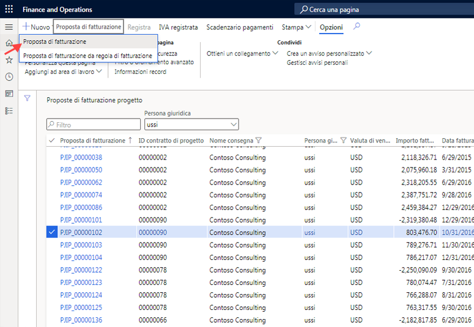
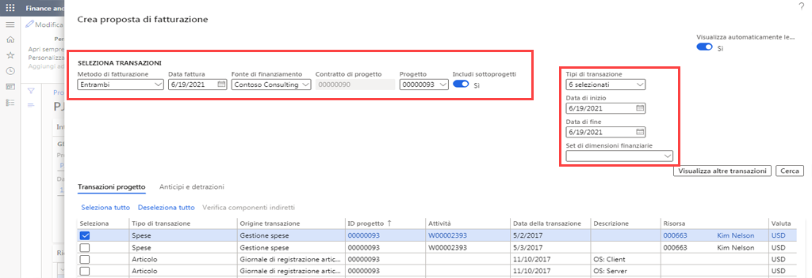
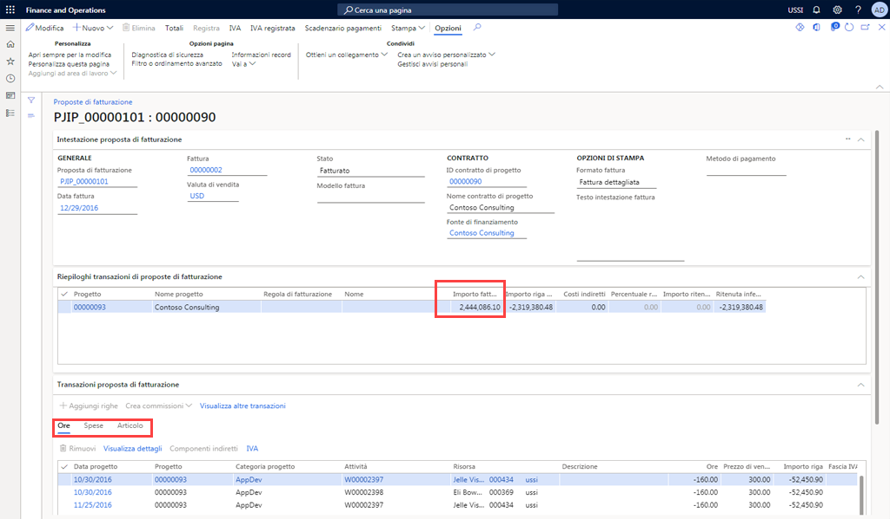
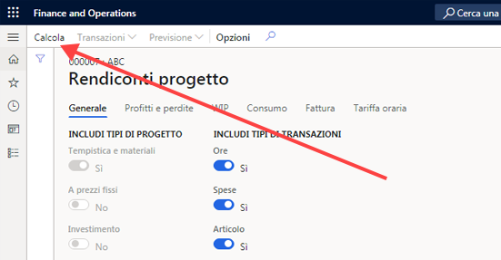

---
demo:
    title: 'Demo 2: Creare una fattura'
    module: 'Modulo 5: Concetti fondamentali su Microsoft Dynamics 365 Project Operations'
---

## Demo 2: Creare una fattura

1. Passare all'area di lavoro **Gestione progetti**.  
    In questa demo verrà descritto il processo di fatturazione di un singolo progetto in Project Operations. Benché sia possibile eseguire una fatturazione collettiva, a scopo dimostrativo qui ci si concentrerà su un singolo progetto di tempistica e materiali. Si osserveranno anche i risultati di registrazione e le informazioni finanziarie dettagliate all'interno del rendiconto del progetto. Iniziare dalla fatturazione del progetto. 

1. Nella selezione della società in alto a destra verificare che la persona giuridica cui si è connessi sia **USSI**. In caso contrario, modificare la persona giuridica in **USSI**.  
    Nell'area di lavoro **Gestione progetti** è possibile visualizzare tutti i progetti attivi. È possibile cercare progetti usando il filtro o, come in questo esempio, selezionare un ID progetto noto. 

1. Nella tabella **Progetti attivi** selezionare **00000093 Contoso Consulting** nella colonna **ID progetto**.  

1. Aprire quindi la pagina **Proposte di fatturazione progetto** per visualizzare tutte le fatture precedenti elaborate per Contoso Consulting. 

1. Nella scheda **FATTURA** nel riquadro azioni selezionare **Proposte di fatturazione progetto**. 

1. Nella pagina **Proposte di fatturazione progetto** selezionare **Nuova** e quindi **Proposta di fatturazione** sulla barra di spostamento.  
    Poiché questa è una semplice fattura di tempistica e materiali, non è necessario selezionare l'opzione Proposta di fatturazione da regola di fatturazione. 

    

1. Nel riquadro **Crea proposta di fatturazione** scegliere le caselle in **Seleziona transazioni**.  
    Da qui è possibile selezionare elementi come il metodo di fatturazione, la data della fattura, la fonte di finanziamento e il progetto. È anche possibile scegliere di includere sottoprogetti, nonché di incorporare tipi di transazione, le date di inizio e di fine per le transazioni e qualsiasi dimensione finanziaria necessaria. 

    

1. Nel menu a discesa **Progetto** selezionare **00000093 Contoso Consulting**. 

1. Per questo esempio, assicurarsi che l'opzione **Data fattura** sia impostata su **1/2/21**, l'opzione **Data di inizio** sia impostata su **1/2/21** e che la data di fine sia quella odierna.  
    Dopo aver effettuato le selezioni, selezionare il pulsante di ricerca per trovare le transazioni che soddisfano questi parametri.

1. Selezionare **Cerca**.  
    Per fatturare tutte le transazioni, selezionare quindi l'opzione Seleziona tutto. Verranno selezionati gli elementi scelti per spese e ore.

1. Nella scheda **Transazioni progetto** selezionare **Seleziona tutto**.

1. Selezionare **OK**. 

1. Nella pagina **Proposta di fatturazione** scegliere la colonna **Importo riga fattura**.  
    Qui è possibile visualizzare l'importo e il riepilogo della fattura, le transazioni orarie e le spese.

    

1. Scegliere la scheda **Ora**. 

1. Scegliere la scheda **Spesa**.  
    È anche possibile passare a osservare la transazione di spesa.  
Selezionare quindi il pulsante Totali per osservare che aspetto avrà la fattura dal punto di vista dei costi e dei ricavi.

1. Sulla barra di spostamento selezionare **Totali**.

1. Nella pagina **Totali** scegliere la colonna **CONTABILITÀ GENERALE**, la colonna **CLIENTE** e la colonna **Sconto riga**.  
    Nella schermata Totali è possibile osservare quale sarà l'impatto sulla contabilità generale, tutte le informazioni come limiti di credito, sconti e IVA e l'impatto netto della fattura. 

1. Sul lato destro della schermata selezionare la **X** per chiudere la pagina.  
    È ora possibile creare un'anteprima di stampa per verificare che tutte le informazioni di fatturazione siano accurate. Alcune organizzazioni usano l'anteprima durante le riunioni di revisione dei progetti per assicurarsi che tutti concordino sui totali prima che la fattura venga finalizza. 

1. Nella pagina **Proposta di fatturazione** selezionare **Anteprima di stampa** sulla barra di spostamento. 

1. Nella finestra di dialogo selezionare **Anteprima di stampa**.  
    Qui è possibile visualizzare un esempio dell'anteprima di stampa per una fattura proforma. 

1. Selezionare la **X** per chiudere la pagina.  
    Dopo aver convalidato tutte le informazioni e quando si è soddisfatti dell'anteprima di stampa della fattura, è possibile registrare la proposta di fatturazione.

1. Sulla barra di spostamento selezionare **Registra**.

1. Selezionare la scheda **Parametri**.

1. In **PARAMETRO** impostare **Registrazione** su **Sì**.

1. In **OPZIONI DI STAMPA** impostare **Stampa fattura** su **Sì**.

1. Selezionare **OK**.

1. Nella pagina **Fattura** scegliere il numero **Fattura**.  
    È stato generato un numero di fattura.  
    Dopo che la fattura è stata registrata, è possibile verificare le informazioni nel giornale di registrazione fatture ed eseguire il drill-down fino alle transazioni contabili.

1. Passare all'area di lavoro **Gestione progetti**.

1. Nella tabella **Progetti attivi** selezionare il progetto **00000093** **Contoso consulting**.

1. Nella scheda **FATTURA** nel riquadro azioni selezionare **Giornali di registrazione fatture**.

1. Nella pagina **Giornale di registrazione fatture** selezionare **Giustificativo** sulla barra delle azioni.

1. Nella pagina **Transazioni giustificativo** scegliere la colonna **Conto CoGe**.  
    Qui è possibile visualizzare i risultati registrati nella contabilità generale. I conti CoGe sono determinati dall'impostazione dei conti e dalle dimensioni finanziarie applicate a ogni progetto.

1. Passare all'area di lavoro **Gestione progetti**. 

1. Nella tabella **Progetti attivi** selezionare il progetto **00000093 Contoso Consulting**.

1. Nella pagina **Contoso Consulting** selezionare **Controlla** sulla barra di spostamento.  
    Qui è possibile visualizzare tutti i dettagli del progetto.  
    Osservare quindi le informazioni finanziarie sul progetto in un rendiconto del progetto.

1. Selezionare **Rendiconti progetto**.

1. Nella pagina **Rendiconti progetto** scegliere la sezione **DATA PROGETTO**.  
È possibile creare un rendiconto per qualsiasi intervallo di date desiderato.

1. Selezionare la casella **Data iniziale** e immettere **1/2/2021**.
1. 
1. Selezionare la casella **Data finale** e immettere la data odierna.

1. Al termine, selezionare **Calcola**.

    

1. Scegliere **Transazioni**.  
    Dopo aver aggiornato i dati, un manager di progetto può scegliere di eseguire ulteriormente il drill-down nei dettagli delle transazioni per prendere decisioni sul progetto o apportare le modifiche necessarie. In questa dimostrazione è stata elaborata una fattura di tempistica e materiali con transazioni orarie e di spesa. La fattura è stata visualizzata in anteprima, quindi è stata registrata, è stata esaminata la registrazione contabile e infine è stato verificato l'impatto finanziario tramite questo rendiconto del progetto.
