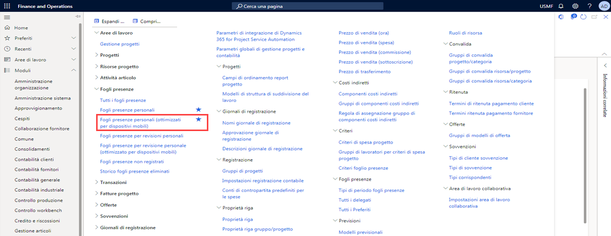
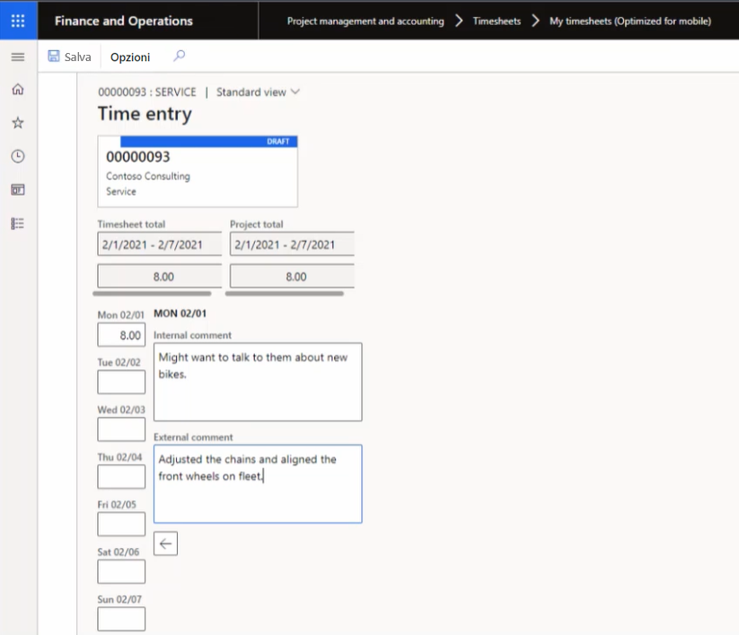

---
demo:
    title: 'Demo 3: Esplorare i costi del progetto'
    module: 'Modulo 5: Concetti fondamentali su Microsoft Dynamics 365 Project Operations'
---

## Demo 3: Esplorare i costi del progetto

In questa demo verrà descritta la creazione di un inserimento ore e di una voce di spesa che verranno addebitati al progetto Contoso Consulting. Si esploreranno le voci in formati ottimizzati per presentazioni Web e su dispositivi mobili e si osserverà come viene usato un flusso di lavoro per gestire il processo di approvazione.

1. Nel pannello di navigazione in **Dynamics 365 for Finance and Operations** selezionare **Moduli > Gestione progetti e contabilità > Fogli presenze > Fogli presenze personali (ottimizzati per dispositivi mobili)**.  
    Per iniziare, anche se non si sta usando un dispositivo mobile qui, si può notare che i formati sono ottimizzati per i dispositivi mobili dopo aver selezionato l'opzione **Fogli presenze personali (ottimizzati per dispositivi mobili)**.

      

    Questa ottimizzazione è un fattore distintivo chiave per le applicazioni aziendali Microsoft e consente di garantire che la curva di apprendimento sia minima tra l'uso sul Web e l'uso su dispositivi mobili.

1. Nella selezione della società in alto a destra verificare che la persona giuridica cui si è connessi sia **USSI**. In caso contrario, modificare la persona giuridica in **USSI**.

1. Nella pagina **Fogli presenze personali** selezionare **Nuovo**.  
    Verrà ora creato un nuovo foglio presenze basato sulle impostazioni configurate.

1. Nel riquadro **Nuovo foglio presenze** scegliere la casella **Data**.  
    La data immessa determinerà il periodo del foglio presenze.

1. Scegliere **Crea da Preferiti**.  
    Se sono stati salvati preferiti, è possibile selezionare l'opzione per creare un foglio presenze dai preferiti per risparmiare tempo.

1. Al termine, selezionare **OK**.

1. Nella pagina **Dettagli fogli presenze personali** selezionare l'icona **+ Nuovo**.

1. Nel riquadro **Nuova riga foglio presenze** scegliere la casella **Persona giuridica**.  
    Verrà aperta la nuova riga del foglio presenze, con dettagli come cliente, progetto, categoria, proprietà della riga e parametri imposte. È anche possibile selezionare una persona giuridica diversa se l'inserimento ore è per conto di un'altra società all'interno dell'organizzazione.

1. Selezionare il menu **ID progetto**.

1. Selezionare uno dei progetti disponibili, ad esempio **Contoso Consulting**.

1. Al termine, selezionare **OK**.  
    Verrà aperta la schermata ottimizzata per dispositivi mobili per l'inserimento ore ed è possibile iniziare a prenotare le ore di ogni giorno per il progetto e la categoria, in questo caso **Servizi**.

1. Nella pagina **Inserimento ore** immettere **8** nella casella **Lun**.  
    Questo valore rappresenta l'inserimento delle ore di un singolo giorno.

    

1. Nella casella **Commento interno** aggiungere un commento. Ad esempio: **Può essere necessario discutere di nuove biciclette**.  
    È anche possibile immettere commenti interni ed esterni sul progetto per garantire che tutte le parti comprendano la natura delle ore registrate.

1. Nella casella **Commento esterno** aggiungere un commento. Ad esempio: **Sono state regolate le catene e sono state allineate le ruote anteriori nel parco biciclette**.

1. Sulla barra di spostamento selezionare **Salva**.

1. Nel menu di spostamento a sinistra selezionare **Fogli presenze personali** in **Fogli presenze**.

1. Nella pagina **Fogli presenze personali** selezionare l'inserimento ore creato in precedenza.

1. Nella scheda **Foglio presenze** scegliere la colonna Categoria.  
    Si presupponga ora di essere tornati a usare un computer e di verificare le ore dal formato Web del foglio presenze. È comunque possibile visualizzare le stesse informazioni, ad esempio categoria e ore.

1. In **Dettagli riga** scegliere **Commento interno** e **Commento esterno**.  
    È anche possibile esaminare i commenti immessi in precedenza. Le informazioni sono presenti, ma il formato del layout è leggermente diverso. Questo formato viene usato spesso per la revisione finale, perché può essere più facile per le persone esaminare e convalidare le proprie ore di presenza, in particolare quando qualcuno è assegnato a più progetti o categorie.

1. Sulla barra di spostamento selezionare la scheda **Flusso di lavoro**.  
    Quando si è soddisfatti del foglio presenze, è possibile inviarlo. Le approvazioni necessarie verranno determinate da ogni organizzazione durante la fase di implementazione in base ai criteri della società.

1. Nel riquadro **Verifica flusso di lavoro foglio presenze** selezionare **Invia**.

1. Nel riquadro **Verifica flusso di lavoro foglio presenze - Invia** aggiungere eventuali altri commenti.

1. Selezionare **Invia**.

1. Passare alla pagina **Transazioni orarie**. Se la scheda **Transazioni orarie** è disattivata, passare alla pagina **Fogli presenze personali** e selezionare il foglio presenze creato in precedenza.

1. Nella sezione **Transazioni orarie** verificare la pagina.  
    All'approvazione, i risultati verranno registrati e saranno visibili nella pagina Transazioni orarie. È possibile visualizzare tutte le informazioni pertinenti, ad esempio persona giuridica, progetto, categoria, ore e, in questo caso, anche una visualizzazione del prezzo di costo e del prezzo di vendita.  

È quindi possibile eseguire il drill-down fino alle transazioni giustificativo.

1. Sulla barra di spostamento selezionare **Giustificativo**.

1. Nella pagina **Transazioni giustificativo** scegliere le sezioni **Conto CoGe** e **Nome conto**.  
    In queste sezioni è possibile osservare l'impatto sulla contabilità generale, nonché i conti che verranno usati.  

Creare ora una voce di spesa per lo stesso progetto Contoso Consulting.

1. Nel pannello di navigazione selezionare **Moduli > Gestione spese > Spese personali > Note spese**.

1. Nella pagina **Gestione spese** selezionare **+ Nuova nota spese** nella scheda **Note spese**.

1. Nel riquadro **Nuova nota spese** immettere un titolo nella casella **Scopo**. Ad esempio, **Contoso - Feb 2021**.

1. Selezionare **OK**.

1. Nella pagina **Spese** selezionare **+ Nuova spesa**.  
Verrà visualizzata una nuova riga spese.

1. Nella colonna **Categoria di spesa** selezionare **Carburante** nel menu a discesa **Categoria**.  
Qui è possibile immettere la nuova spesa con tutti i dettagli.

1. Nella colonna **Importo transazione** immettere **25.00**.

1. Nella colonna **Valuta** selezionare **USD**.

1. Nella colonna **Data transazione** selezionare una data. Ad esempio, **1/2/2021**.  
    Dopo aver immesso tutti i dettagli, è possibile salvare la spesa.

1. Selezionare **Salva**.

1. Nel menu di spostamento a sinistra selezionare **Gestione spese** in **Aree di lavoro**.

1. Nella pagina **Gestione spese** selezionare la nota spese appena creata.

1. Nella pagina **Nota spese** selezionare la casella **ID progetto** e quindi selezionare **00000093 Contoso Consulting**.  

È quindi possibile indicare che il carburante verrà addebitato al progetto Contoso Consulting, aggiungendo altre informazioni sulla spesa.

1. Scegliere la casella **Informazioni aggiuntive**.

1. Sul lato inferiore destro dello schermo selezionare **Salva e continua**.

1. Sul lato destro dello schermo selezionare **Invia**.

1. Nella casella **Commento** aggiungere qualsiasi altro commento.

1. Selezionare **Invia**.

1. Nella pagina **Gestione spese** scegliere la colonna **Stato approvazione**.  
    A questo punto, verranno attivati i criteri di viaggio e il flusso di approvazione della spesa. I costi sono stati registrati e applicati al progetto Contoso Consulting e saranno successivamente disponibili per la fatturazione, se addebitabili.

In questa demo sono stati elaborati un inserimento ore e una voce di spesa che sono stati addebitati al progetto Contoso Consulting. Sono stati mostrati alcuni esempi nei formati Web e per dispositivi mobili e si è osservato come vengono usati i flussi di lavoro per gestire le approvazioni richieste dall'organizzazione USSI.
