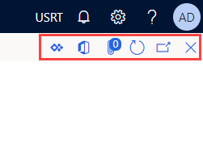

---
lab:
  title: 'Lab 1: Esplorare le app finanziarie e operative'
  module: 'Module 1: Explore the core capabilities of Dynamics 365 finance and operations apps'
---

# Modulo 1. Esplorare le funzionalità principali delle app per la finanza e le operazioni di Dynamics 365

## Lab 1: Esplorare le app finanziarie e operative

## Obiettivo

Dopo aver acquisito familiarità con le app finanziarie e operative, dedicare del tempo all'esplorazione dell'interfaccia.

## Configurazione del lab

- **Tempo** stimato: 10 minuti

## Istruzioni

### Accedere al computer lab

1.  Accedere al computer lab usando le credenziali seguenti:

    - Nome utente: `Administrator`

    - Password: `pass@word1`

1.  Attendere il completamento dello script AdminUserProvisioning prima di continuare. L'operazione può richiedere 2-3 minuti. Una volta completato lo script, verrà visualizzata brevemente una finestra popup per confermare che l'utente amministratore è stato aggiornato correttamente. 

1.  **Microsoft Edge** aprirà l'URL di Finance and Operations: <https://usnconeboxax1aos.cloud.onebox.dynamics.com>

1.  Accedere usando il nome utente e la password indicati nel menu **Risorse**. 

### Spostamento nelle app per la finanza e le operazioni

Ora che si è acquisita familiarità con le app per la finanza e le operazioni è possibile esplorare le interfacce.

1.  La home page delle **app per la finanza e le operazioni**, se configurata, contiene:

    - Il menu di spostamento a sinistra, compresso per impostazione predefinita.

    - Il logo della società.

    - Riquadri dell'area di lavoro disponibili in base al ruolo nell'organizzazione.

    - Un calendario e gli elementi di lavoro assegnati.

    - La barra di ricerca, utile per trovare velocemente gli elementi necessari.

    - In alto a destra sono presenti la società con cui si sta attualmente lavorando, le notifiche, le impostazioni e i collegamenti della guida. Verificare che la società elencata sia **USMF**.

    

2.  In alto a sinistra selezionare il menu a forma di hamburger **Espande il riquadro di spostamento**.

3.  Il riquadro di spostamento include le raccolte di **Preferiti**, **Elementi recenti**, **Aree di lavoro** e **Moduli**.

4.  Nel riquadro di spostamento selezionare **Moduli** > **Amministrazione sistema**.

5.  Esaminare le aree disponibili nel modulo Amministrazione sistema.

6.  In **Configurazione** selezionare **Opzioni prestazioni del cliente**.

7.  Nel riquadro **Opzioni prestazioni client** selezionare l'interruttore in **Callout di funzionalità abilitati** e assicurarsi che sia impostato su **Sì**.

8.  Rivedere le altre opzioni disponibili, scorrere fino alla fine del riquadro e quindi selezionare **OK**.

9.  Selezionare l'icona **Impostazioni** nell'angolo in alto a destra della **home page**, quindi scegliere **Opzioni utente**.

    

10. Nella pagina **Opzioni** usare le schede per configurare le diverse impostazioni applicabili all'account.

11. Selezionare la scheda **Preferenze**.

12. Rivedere le preferenze disponibili. Notare che è possibile modificare la società predefinita e la pagina iniziale visualizzata all'accesso.

13. Selezionare e rivedere le schede **Account** e **Flusso di lavoro**.

14. Nel menu di spostamento a sinistra selezionare l'icona **Home**.

15. In alto al centro della **home page** selezionare la casella **Cerca una pagina**.

16. Nella casella di ricerca immettere **Tutti i fornitori**.

17. Selezionare **Tutti i** fornitori Contabilità > fornitori

18. Potrebbe essere necessario attendere qualche istante la prima volta che si cerca una pagina. Durante l'elaborazione della ricerca compare un piccolo cerchio che ruota a destra della casella di ricerca.

19. La pagina **Tutti i fornitori** è un esempio di pagina elenco. La pagina elenco contiene dati master che è possibile leggere, creare, eliminare e aggiornare. La barra multifunzione sopra l'elenco offre ulteriori funzionalità.

    

20. Evidenziare uno dei fornitori dall'elenco, selezionare sulla destra il menu **Informazioni correlate**, quindi rivedere le informazioni aggiuntive fornite.

21. Nell'elenco dei fornitori selezionare **Acme Office Supplies**.

22. Selezionare il menu **Gruppo** e scegliere il titolo della colonna **Gruppo fornitori**.

    

23. Molti menu dispongono delle opzioni di ordinamento e filtro. Usare i filtri per individuare rapidamente il contenuto del campo che si sta cercando.

24. Notare in alto a destra la funzionalità aggiuntiva. Spostare il mouse su ciascun elemento per visualizzare il callout della funzionalità. Al termine, selezionare l'icona **Chiudi** per chiudere la pagina e tornare alla **home page**.

    

25. Selezionare l'icona **Guida** a forma di punto interrogativo in alto a destra, quindi scegliere **Guida**.

26. Notare che le informazioni della guida sono relative alla pagina corrente.

27. Provare a selezionare un riquadro dell'area di lavoro, quindi esaminare le informazioni della guida per quell'area di lavoro. Al termine, tornare alla **home page**.

