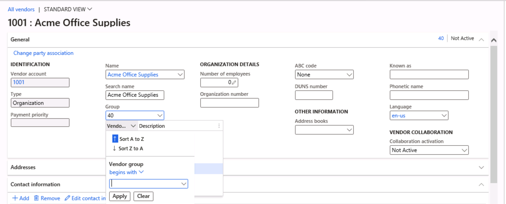

---
lab:
    title: 'Lab 1: Esplorare le app Finance and Operations'
    module: 'Modulo 1: Concetti fondamentali su Microsoft Dynamics 365 Supply Chain Management'
---

# Modulo 1: Concetti fondamentali su Microsoft Dynamics 365 Supply Chain Management

## Lab 1. Esplorare le app Finance and Operations

## Obiettivi

Ora che è stata acquisita familiarità con le app Finance and Operations, dedicare del tempo a esplorarne l'interfaccia.

## Configurazione del lab

- **Tempo stimato**: 10 minuti

## Istruzioni

### Accedere al computer del lab

1. Accedere al computer del lab usando le credenziali seguenti

    - Nome utente:

        Incollare il contenuto

        Administrator

    - Password:

        Incollare il contenuto

        pass@word1

    >[!Nota] Internet Explorer può venire aperto automaticamente nel desktop. Se non sono già stati completati i passaggi 2-5, completarli prima di tornare a Internet Explorer.

1. Selezionare il file **AdminUserProvisioning** sul desktop.

1. Immettere le credenziali fornite e quindi selezionare **Invia**.  
Le credenziali sono disponibili nel menu **Risorse** nell'angolo in alto a destra dello schermo.

1. Attendere il completamento dello script prima di continuare. Questa operazione può richiedere 2-3 minuti. Una volta completato lo script, verrà visualizzata una finestra popup per confermare che l'utente amministratore è stato aggiornato correttamente.

1. Selezionare **OK** per continuare.

1. Aprire **Internet Explorer**.

1. Passare al collegamento indicato: <https://usnconeboxax1aos.cloud.onebox.dynamics.com>

1. Effettuare l'accesso usando le credenziali fornite nel menu **Risorse**.

### Esplorare le app Finance and Operations
1. Nella home page di Finance and Operations, se è stata eseguita la configurazione, verrà visualizzato quanto segue:

    - Il menu di spostamento a sinistra che è compresso per impostazione predefinita.

    - Il logo della società.

    - I riquadri dell'area di lavoro disponibili per l'utente in base al relativo ruolo nell'organizzazione.

    - Un calendario e gli elementi di lavoro assegnati all'utente.

    - La barra di ricerca, che è molto utile per trovare rapidamente ciò che è necessario.

    - In alto a destra sono presenti la società per cui l'utente lavora, le notifiche, le impostazioni e collegamenti alla Guida.  
    Verificare che la società indicata sia **USMF**.

    

1. In alto a sinistra selezionare il menu hamburger **Espandere il pannello di navigazione**.

1. Il pannello di navigazione è l'area in cui sono disponibili le raccolte relative a **Preferiti**, elementi **Recenti**, **Aree di lavoro** e **Moduli**.

1. Nel pannello di navigazione selezionare **Moduli** > **Amministrazione sistema**.

1. Esaminare le aree disponibili nel modulo Amministrazione sistema.

1. In **Configurazione** selezionare **Opzioni di prestazioni client**.

1. Nel riquadro Opzioni di prestazioni client, in **Callout delle funzionalità attivati** selezionare l'interruttore e assicurarsi che sia impostato su **Sì**.

1. Esaminare le altre opzioni disponibili, scorrere verso la parte inferiore del riquadro e quindi selezionare **OK**.

1. Nell'angolo in alto a destra della home page selezionare l'icona Impostazioni e quindi selezionare Opzioni utente.

    

1. Nella pagina Opzioni usare le schede per configurare le diverse impostazioni da applicare all'account.

1. Selezionare la scheda **Preferenze**.

1. Esaminare le preferenze disponibili. Si noti che è possibile modificare la società predefinita e la visualizzazione pagina iniziale che viene mostrata all'accesso.

1. Selezionare ed esaminare le schede **Account** e **Flusso di lavoro**.

1. Nel menu di spostamento a sinistra selezionare l'icona **Home**.

1. Nella parte superiore centrale della home page selezionare la casella **Cerca una pagina**.

1. Nella casella di ricerca cercare **Tutti i fornitori**.

1. La prima volta che si cerca una pagina, può essere necessario attendere un po' di tempo. Mentre la ricerca è in corso, verrà visualizzato un piccolo cerchio che ruota a destra della casella di ricerca.

1. La pagina Tutti i fornitori è un esempio di pagina elenco. La pagina elenco contiene in genere i dati master che è possibile leggere, creare, eliminare e aggiornare. Usando la barra multifunzione sopra l'elenco, verranno visualizzate altre funzionalità.

    

1. Evidenziare uno dei fornitori nell'elenco, quindi a destra selezionare il menu **Informazioni correlate** ed esaminare le informazioni aggiuntive fornite.

1. Nell'elenco di fornitori selezionare **Acme Office Supplies**.

1. Selezionare il menu **Gruppo** e quindi l'intestazione di colonna **Gruppo di fornitori**.

    

1. In molti menu sono disponibili opzioni di ordinamento e filtro. Usare i filtri per individuare rapidamente il contenuto del campo che si sta cercando.

1. In alto a destra osservare la funzionalità aggiuntiva. Spostare il mouse su ogni elemento ed esaminare il callout della funzionalità. Al termine, selezionare l'icona **Chiudi** per chiudere la pagina e tornare alla home page.

    

1. Nell'angolo in alto a destra seleziona l'icona a forma di punto interrogativo della **Guida** e quindi selezionare **Guida**.

1. Osservare che le informazioni della Guida sono correlate alla pagina corrente.

1. Provare a selezionare un riquadro dell'area di lavoro ed esaminare le informazioni della Guida per tale area di lavoro. Al termine, tornare alla home page.
