---
lab:
    title: 'Lab 2: Esplorare le aree di lavoro e i filtri'
    module: 'Modulo 1: Concetti fondamentali su Microsoft Dynamics 365 Supply Chain Management'
---

# Modulo 1: Concetti fondamentali su Microsoft Dynamics 365 Supply Chain Management

## Lab 2. Esplorare le aree di lavoro e i filtri

## Obiettivi

Quando si accede per la prima volta a Finance and Operations, sono disponibili molte aree di lavoro predefinite. È anche possibile creare un'area di lavoro personalizzata in base alle esigenze. Le aree di lavoro sono una delle numerose funzionalità di Dynamics 365, ma è importante tenere anche presente che i filtri sono lo strumento con cui ottenere gli elementi specifici desiderati. È necessario creare una nuova area di lavoro personalizzata e usare i filtri per identificare i diversi elementi necessari.

## Configurazione del lab

   - **Tempo stimato**: 10 minuti

## Istruzioni

1. Nella home page di Finance and Operations, a destra dei riquadri dell'area di lavoro fare clic con il pulsante destro del mouse o toccare e tenere premuto in un'area vuota per attivare il menu.

    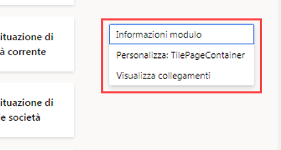

1. Nel menu selezionare **Personalizza: TilePageContainer**.

1. Nella finestra Personalizza selezionare **+ Aggiungi area di lavoro**.

1. Se la piccola finestra Personalizza non è visibile, provare a scorrere verso l'alto nella home page e fare clic con il pulsante destro del mouse o toccare e tenere premuto, quindi selezionare **Personalizza: TilePageContainer** di nuovo.

    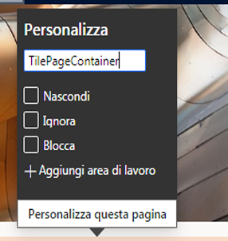

1. Nella home page scorrere verso il basso e individuare il nuovo riquadro **Area di lavoro personale 1**.

    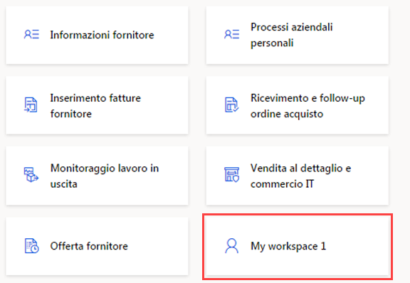

1. Fare clic con il pulsante destro del mouse o toccare e tenere premuto il riquadro e quindi selezionare **Personalizza: Area di lavoro personale 1**.

1. Nella finestra Personalizza rinominare Area di lavoro personale 1 in **My workspace** e quindi selezionare **Personalizza questa pagina**.  
    La modifica al nome verrà salvata automaticamente.

1. Nella barra degli strumenti appena aperta selezionare **Sposta**.

    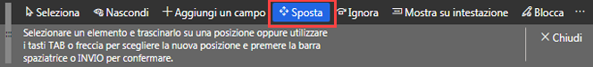

1. Selezionare il riquadro **My workspace** e spostarlo in un'altra posizione nella home page.

    >[!Nota] Se non è possibile spostare il riquadro, aggiornare la pagina e provare a eseguire di nuovo i passaggi precedenti per spostarlo.

1. Chiudere la barra degli strumenti.

1. Nella casella **Cerca una pagina** nella home page cercare e selezionare **Tutti i fornitori**.

1. Nella pagina Tutti i fornitori, nel menu in alto selezionare **Opzioni** > **Aggiungi ad area di lavoro**.

1. Nella casella di filtro **Area di lavoro** immettere **My workspace** e quindi selezionare l'area di lavoro.

1. Selezionare il menu Presentazione, esaminare le opzioni disponibili e quindi selezionare **Riquadro**.

1. Al termine, selezionare **Configura**.

1. Nel riquadro Aggiungi come riquadro verificare il nome del riquadro e quindi selezionare **OK**.

1. Nel pannello di navigazione a sinistra selezionare l'icona **Home**.

1. Nella home page selezionare la nuova area di lavoro.

1. Nella pagina My workspace verificare che sia visualizzato il nuovo riquadro Fornitori aggiunto.

1. Selezionare il riquadro **Fornitori**.

1. Nella pagina Tutti i fornitori, nella casella **Filtro** immettere **Contoso**.

1. Esaminare i diversi campi che è possibile usare per trovare Contoso.

    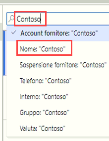

1. Selezionare **Nome: "Contoso"** e quindi verificare i risultati del filtro.

1. Cancellare la casella di filtro e premere INVIO per visualizzare tutti i fornitori.

1. Selezionare l'intestazione di colonna **Gruppo**.

    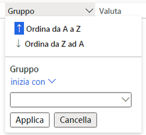

1. È possibile usare questa opzione per ordinare i gruppi dal più basso al più elevato (Ordina dalla A alla Z) o viceversa (Ordina dalla Z alla A).

1. In **Gruppo** selezionare il menu **inizia con** ed esaminare gli operatori di confronto. Selezionare **è esattamente**.

1. Selezionare il menu sotto a **è esattamente** e quindi selezionare **Altri fornitori**.  
    In alternativa, è possibile immettere un valore nel campo del menu.

1. Selezionare **Applica** ed esaminare i risultati. Osservare l'icona di filtro nell'intestazione di colonna Gruppo.

    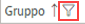

1. Selezionare la colonna **Gruppo** e quindi nel menu del filtro selezionare **Cancella**.

1. A sinistra del riquadro Tutti i fornitori selezionare l'icona di filtro.

    

1. Nell'angolo in alto a destra del riquadro Filtro selezionare **+ Aggiungi**.

1. Nel riquadro dei campi Aggiungi filtro selezionare la casella di controllo a sinistra di **Gruppo** e quindi selezionare Aggiorna.

1. Si noti che il filtro è stato aggiunto. In questo modo, è possibile filtrare l'elenco in base a uno o più criteri.

    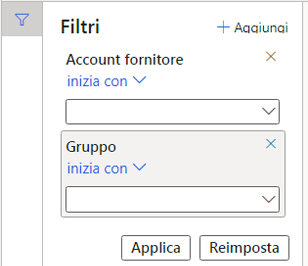

1. Nel filtro **Account fornitore inizia con** selezionare il menu e quindi **Northwind Traders**.

1. Nel filtro **Gruppo inizia con** seleziona il menu e quindi **30**.

1. Selezionare **Applica** ed esaminare i risultati del filtro.

1. Nel riquadro Filtri selezionare **Reimposta** e osservare che il filtro aggiuntivo è stato rimosso e il filtro predefinito è stato reimpostato su un valore vuoto.

1. Sulla barra multifunzione selezionare **Opzioni** e quindi nelle sezioni Opzioni pagina selezionare **Filtro o ordinamento avanzato**.

    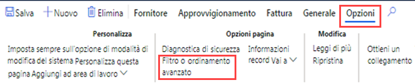

1. Nella finestra Richiesta info - Fornitori selezionare **+ Aggiungi**.

1. Nella cella Campo nella nuova riga selezionare il menu e quindi **Gruppo**.

1. In alternativa, è possibile selezionare il menu, iniziare a digitare il nome del gruppo e quindi selezionare il gruppo nei risultati del filtro.

1. Nella cella Criteri selezionare l'icona **Apri**.

    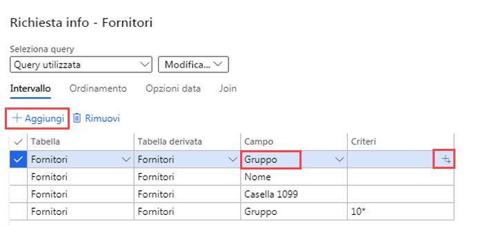

1. Nell'elenco Gruppo di fornitori selezionare **30 Altri fornitori**.

1. Per salvare la nuova query, in **Seleziona query** selezionare il menu **Modifica** e quindi selezionare **Salva con nome**.

    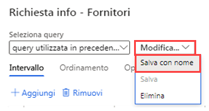

1. Nel riquadro Salva query, nella casella **Nome** immettere My query e quindi selezionare **OK**.

1. Nella pagina Richiesta info - Fornitori selezionare **OK**.

1. Verificare che l'elenco rifletta i risultati della nuova query creata.

1. Per rimuovere il filtro, selezionare **Filtro o ordinamento avanzato** e quindi nella pagina Richiesta info - Fornitori selezionare **Reimposta** e **OK**.

1. In questo modo, la query verrà reimpostata, ma la query salvata non verrà eliminata.
