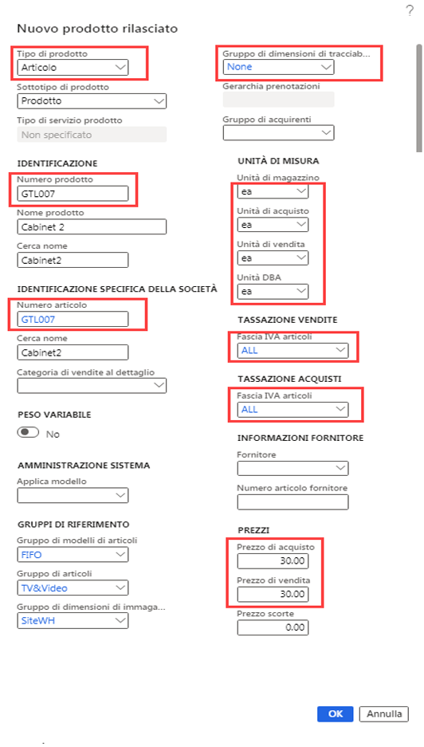
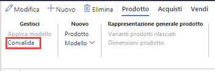
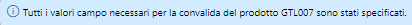

---
lab:
    title: 'Lab 3: Creare un’offerta di prodotto con dimensioni e colori diversi'
    module: 'Modulo 1: Concetti fondamentali su Microsoft Dynamics 365 Supply Chain Management'
---

# Modulo 1: Concetti fondamentali su Microsoft Dynamics 365 Supply Chain Management

## Lab 3. Creare un nuovo prodotto

## Obiettivi

In Contoso Entertainment System USA (USMF) è necessario creare un nuovo articolo per una nuova configurazione di un armadietto da acquistare dai fornitori.

## Configurazione del lab

   - **Tempo stimato**: 10 minuti

## Istruzioni

1. Nella home page Finance and Operations, in alto a destra, verificare di lavorare con la società USMF.

1. Se necessario, selezionare la società e scegliere **USMF** dal menu.

1. In alto a sinistra selezionare il menu hamburger **Espandere il pannello di navigazione**.

1. Nel pannello di navigazione selezionare **Moduli** > **Gestione informazioni sul prodotto** e quindi nella categoria **Prodotti** selezionare **Prodotti rilasciati**.

1. Nella pagina dettagli Prodotto rilasciato, nel menu in alto selezionare **+ Nuovo**.

1. Nel riquadro Nuovo prodotto rilasciato, nel menu **Tipo di prodotto** verificare che sia selezionato **Articolo**.

1. Nel menu **Sottotipo di prodotto** verificare che sia selezionato **Prodotto**.

1. Selezionare il menu **Gruppo di dimensioni di tracciabilità**, quindi scegliere **Nessuno**.

1. In **IDENTIFICAZIONE**, nelle caselle **Numero prodotto** e **Numero articolo** immettere **GTL007**.

1. Nella casella **Nome prodotto** immettere **Cabinet 2**.

1. In **GRUPPI DI RIFERIMENTO** selezionare il menu **Gruppo di modelli di articoli**, quindi selezionare **FIFO (First-In-First-Out)**.

1. Selezionare il menu **Gruppo di articoli** e quindi scegliere **TV&Video**.

1. Selezionare il menu **Gruppo di dimensioni di immagazzinamento**, quindi scegliere **SiteWH**.

1. In **UNITÀ DI MISURA** verificare che siano impostati i valori seguenti:

    | **Impostazione**| **Valore**|
    | :--- | :--- |
    | Unità di magazzino| ea per tutti|
    | Unità di acquisto| ea per tutti|
    | Unità di vendita| ea per tutti|
    | Unità DBA| ea per tutti|

1. In **TASSAZIONE VENDITE** selezionare il menu **Fascia IVA articoli**, quindi selezionare **TUTTO**.

1. In **TASSAZIONE ACQUISTI** selezionare il menu **Fascia IVA articoli**, quindi selezionare **TUTTO**.

1. In PREZZI, nella casella Prezzo di acquisto immettere 30.00.

1. Nella casella Prezzo di acquisto immettere 30.00.

1. Il nuovo prodotto rilasciato sarà simile a quanto segue:

    

1. Selezionare **OK**.

1. Per assicurarsi che il prodotto sia finalizzato, sulla barra multifunzione in **Gestisci** selezionare **Convalida**.

    

1. Verificare che venga visualizzato il banner di informazioni che conferma che tutti i valori dei campi richiesti sono stati convalidati.

    

1. Chiudere tutte le pagine e tornare alla home page.
