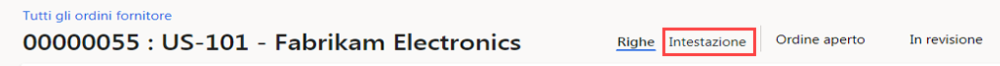
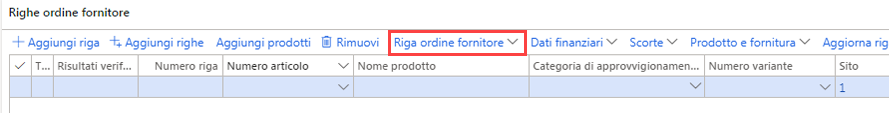

---
lab:
    title: 'Lab 4: Creare un ordine fornitore'
    module: 'Modulo 1: Concetti fondamentali su Microsoft Dynamics 365 Supply Chain Management'
---

# Modulo 1: Concetti fondamentali su Microsoft Dynamics 365 Supply Chain Management

## Lab 4. Creare un ordine fornitore

## Obiettivi

In genere, gli ordini fornitore vengono creati automaticamente come risultato di una pianificazione generale, una consegna diretta e altri processi. Quando la creazione avviene manualmente, in genere un ordine fornitore viene creato da un addetto acquisti. Creare un ordine fornitore usando la società USMF.

## Configurazione del lab

   - **Tempo stimato**: 10 minuti

## Istruzioni

1. Nella home page Finance and Operations, in alto a destra, verificare di lavorare con la società USMF.

1. Se necessario, selezionare la società e scegliere **USMF** dal menu.

1. In alto a sinistra selezionare il menu hamburger **Espandere il pannello di navigazione**.

1. Selezionare **Moduli** > **Approvvigionamento** > **Ordini fornitore** > **Tutti gli ordini fornitore**.

1. Nella pagina Tutti gli ordini fornitore, nel menu in alto selezionare **+ Nuovo**.

1. Nel riquadro Crea ordine fornitore selezionare il menu **Account fornitore** e quindi **US-101**.

1. Quando si seleziona un fornitore, i dettagli del record fornitore, ad esempio indirizzo, conto fatture, termini di consegna e modalità di consegna, verranno copiati come valori predefiniti nell'intestazione dell'ordine. È possibile modificare questi valori in qualsiasi momento.

1. Espandere la sezione **Generale**.

1. In **DIMENSIONI DI IMMAGAZZINAMENTO** selezionare il menu **Sito** ed esaminare l'elenco di siti.

1. Il campo Sito, insieme al campo Magazzino, specifica dove devono essere consegnati i beni o i servizi approvvigionati. L'indirizzo di consegna predefinito è il sito. Entrambi i campi possono essere popolati con i valori configurati per il fornitore selezionato oppure è possibile specificarli manualmente.

1. In **DATE** il campo Data di consegna consente di specificare quando devono essere consegnati i beni o i servizi approvvigionati.

1. È possibile specificare una singola data di consegna per l'ordine oppure date di consegna specifiche per ogni riga ordine. Se la data di consegna specificata non può essere rispettata per determinati prodotti o servizi a causa di lead time più lunghi, tali righe verranno create con una data di consegna successiva.

1. Espandere la sezione **Amministrazione**. La casella **Autore ordine** consente di specificare chi sta effettuando l'ordine.

1. Può essere utile condividere queste informazioni con il fornitore nel caso in cui debba contattare tale persona. Il valore può essere assegnato automaticamente se l'account utente corrente è associato a un nome nella pagina Utenti.

1. Selezionare **OK**.

1. L'intestazione ordine è ora stata creata. Quando si lavora con le righe ordine fornitore, viene visualizzato solo un riepilogo delle informazioni dell'intestazione. Per visualizzare il resto delle informazioni, selezionare **Intestazione**.

    

1. In **Righe ordine fornitore** scegliere **Riga ordine fornitore** dal menu.

    

1. In **VISUALIZZAZIONE** selezionare **Dimensioni**.

1. I prodotti possono avere varianti che si differenziano per le dimensioni, ad esempio colore, misura o stile. È anche possibile impostare i prodotti per usare le dimensioni di immagazzinamento, ad esempio sito e warehouse. Sono disponibili anche altre dimensioni di tracciabilità opzionali, ad esempio numeri di batch e di serie. Per migliorare l'efficienza di una registrazione ordine, è possibile aggiungere i campi delle dimensioni usati comunemente direttamente nella griglia dell'ordine.

1. Nel riquadro Visualizzazione dimensioni, in **DIMENSIONI PRODOTTO** selezionare la casella di controllo **Colore**.

1. Facoltativo: se si seleziona l'interruttore Salva impostazione, le dimensioni scelte verranno visualizzate anche nella griglia delle righe ordine alla successiva apertura della pagina ordine fornitore.

1. Selezionare **OK**.

1. Selezionare il menu cella **Numero articolo** e quindi scegliere **T0004**.

1. Tenere presente che è anche possibile digitare nella casella di filtro anziché scorrere l'elenco.

1. Le righe ordine vengono create per i prodotti e i servizi specificando un numero di articolo oppure come spese specificando una categoria di approvvigionamento.

1. La categoria di approvvigionamento viene usata per aggiungere righe quando gli articoli approvvigionati vengono contabilizzati direttamente invece che essere inseriti nell'inventario. Ciò significa che se è necessario contabilizzare un acquisto, è possibile farlo creando una riga ordine fornitore che specifica una categoria di approvvigionamento, anziché creare una riga con un numero di articolo. Gli articoli possono anche essere associati a una categoria di approvvigionamento e in questo caso la categoria viene visualizzata solo a scopo informativo.

1. Selezionare il menu **Colore**, esaminare le opzioni disponibili e quindi selezionare uno dei colori o delle combinazioni di colori.

1. Sito e magazzino vengono in genere popolati con i valori dell'intestazione ordine, ma è possibile sovrascrivere questi campi se alcune righe devono essere consegnate in ubicazioni diverse.

1. Nella casella **Quantità** immettere **10**.

1. Il valore di Quantità viene popolato automaticamente con la quantità ordine minima per il prodotto, se è stata impostata, oppure con il valore 1.

1. Alcune informazioni aggiuntive:

    - **Unità**: indica l'unità di misura per la quantità ordinata. In genere, questa unità viene fornita automaticamente dall'unità di acquisto nei dati master del prodotto.

    - **Prezzo unitario**: contiene un valore derivato da un contratto di acquisto o da un accordo commerciale. È possibile modificare il prezzo unitario per singole righe ordine, ad esempio se viene negoziato un prezzo specifico con il fornitore.

    - **Sconto**: rappresenta l'importo dello sconto per unità. Questo sconto riduce quindi il prezzo unitario dell'importo corrispondente. Lo sconto viene in genere fornito automaticamente dai contratti di acquisto o dagli accordi commerciali, ma è possibile sostituire l'importo in singole righe se sono stati negoziati sconti specifici con il fornitore.

    - **Percentuale sconto**: quando viene immessa, l'importo netto della riga viene ridotto di conseguenza. La percentuale di sconto viene in genere fornita automaticamente dai contratti di acquisto o dagli accordi commerciali, ma è possibile sostituire il valore in singole righe se è stata negoziata una percentuale di sconto specifica con il fornitore.

    - **Importo netto**: calcolato in base ad altri campi della riga, tra cui Quantità, Prezzo unitario, Sconto e Percentuale sconto. È possibile modificare il valore di Importo netto, ma in questo caso i campi Prezzo unitario, Sconto e Percentuale sconto saranno vuoti e quando si esegue una registrazione in base alla riga l'importo registrato sarà proporzionale all'importo netto. In genere, il campo Importo netto viene usato solo per visualizzare l'importo netto della riga.

1. Sotto alle righe ordine fornitore, nella parte inferiore della pagina, selezionare **Dettagli riga**.

1. Selezionare la scheda **Consegna**.

1. È possibile assegnare una data di consegna univoca a ogni riga dell'ordine. La data viene ereditata dal campo nell'intestazione dell'ordine fornitore, ma è possibile modificarla.

1. Chiudere la pagina Riga ordine fornitore.

1. Nella pagina Tutti gli ordini fornitore usare la funzionalità di filtro e cercare il nuovo ordine fornitore.

1. Al termine, chiudere la pagina Tutti gli ordini fornitore e tornare alla home page.
