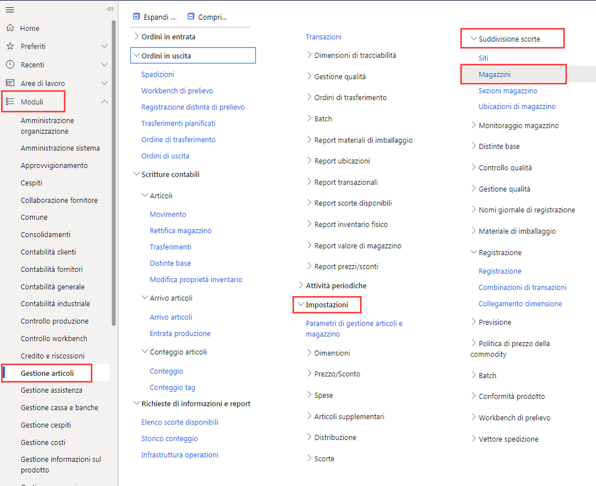
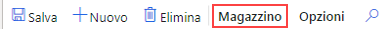

---
lab:
    title: 'Lab 5: Creare un magazzino'
    module: 'Modulo 1: Concetti fondamentali su Microsoft Dynamics 365 Supply Chain Management'
---

# Modulo 1: Concetti fondamentali su Microsoft Dynamics 365 Supply Chain Management

## Lab 5. Creare un magazzino

## Obiettivi
Il sistema di gestione magazzino in Supply Chain Management offre modi flessibili per definire il layout del magazzino in modo da soddisfare le esigenze in continua evoluzione, così da ottenere un'efficienza ottimale del magazzino.

- È possibile stabilire le aree di stoccaggio ad alta priorità e a bassa priorità per una collocazione ottimale dei beni.
- È possibile dividere il magazzino in zone per rispondere alle diverse esigenze di stoccaggio, come requisiti di temperatura o diverse frequenze di rotazione per gli articoli.
- È possibile specificare le ubicazioni di magazzino a qualsiasi livello (ad esempio sito, magazzino, sezione, scaffale, ripiano e collocazione).
- È possibile raggruppare le ubicazioni usando impostazioni di vincolo della capacità fisica.
- È possibile controllare come vengono stoccati e prelevati gli articoli in base a regole definite da query.

Per usare la gestione magazzino in Supply Chain Management, è necessario creare un magazzino e abilitarlo per attività di gestione più avanzate o specializzate.

## Configurazione del lab

   - **Tempo stimato**: 10 minuti

## Istruzioni

1. Nella home page Finance and Operations, in alto a destra, verificare di lavorare con la società USMF.

1. Se necessario, selezionare la società e scegliere **USMF** dal menu.

1. Nel pannello di navigazione a sinistra selezionare **Moduli** > **Gestione inventario** > **Configurazione** > **Suddivisione scorte** > **Magazzini**.

    

1. Nella pagina Magazzini, nel menu in alto selezionare **Nuovo**.

1. Nel campo **Magazzino** immettere **101**.

1. Nel campo **Nome** immettere **Overflow Warehouse**.

1. Selezionare il menu **Sito** e quindi selezionare **3 Home foam production**.

1. Espandere **Nomi ubicazioni**.  
    Le opzioni in questa sezione definiscono il formato predefinito per i nomi delle ubicazioni.

1. Impostare le opzioni **Includi sezione** e **Includi scaffale** su **Sì**.

1. Nella casella **Formato** per lo scaffale immettere un valore.  
    Se ad esempio il formato nel nome dell'ubicazione per lo scaffale deve contenere OVFL, immettere tale valore nella casella Formato.

1. In **LIVELLO** impostare l'opzione **Includi ripiano** su **Sì**.

1. Nel campo **Formato** per il ripiano immettere **-##**.

1. Nel menu in alto selezionare **Magazzino**.

    

1. In **Gestisci** selezionare **Creazione guidata ubicazione**.

1. Nella pagina iniziale esaminare le informazioni e quindi selezionare **Avanti** nell'angolo inferiore destro.

1. Deselezionare le caselle di controllo **Banchine di uscita** e **Ubicazioni di stoccaggio**.

1. Selezionare **Avanti** ed esaminare le informazioni.

1. Procedere alle pagine successive e al termine selezionare **Fine**.

1. Chiudere la pagina e tornare alla home page.
