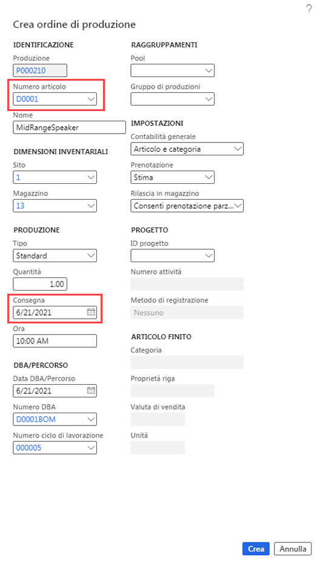

---
lab:
  title: 'Lab 6: Creare un ordine di produzione'
  module: 'Module 1: Learn the Fundamentals of Microsoft Dynamics 365 Supply Chain Management'
ms.openlocfilehash: 222c557f935bc0dcfaa4f2e96049774f141ea028
ms.sourcegitcommit: 252458fca8e71b6e5e8b99ae4c2b47cd85461a30
ms.translationtype: HT
ms.contentlocale: it-IT
ms.lasthandoff: 01/27/2022
ms.locfileid: "137909732"
---
## Lab 6. Creare un ordine di produzione

## Obiettivi

L'ordine di produzione contiene informazioni su ciò che verrà prodotto, sulla quantità da produrre e sulla data di fine pianificata. Contiene inoltre informazioni sui materiali da usare e sul processo da seguire per la produzione dell'articolo.

È necessario creare un nuovo ordine di produzione per la società.

## Configurazione del lab

   - **Tempo stimato**: 5 minuti

## Istruzioni

1. Nella home page Finance and Operations, in alto a destra, verificare di lavorare con la società USMF.

1. Se necessario, selezionare la società e scegliere **USMF** dal menu.

1. Nel riquadro di spostamento a sinistra selezionare **Moduli** > **Controllo produzione** > **Ordini di produzione** > **Tutti gli ordini di produzione**.

1. Nel menu in alto selezionare **Nuovo ordine di produzione**.

1. In **IDENTIFICAZIONE**, nella casella **Numero articolo** immettere **D0001** e quindi selezionare l'articolo identificato.

1. In **PRODUZIONE**, nella casella **Consegna**, selezionare una data a un mese da oggi.  
    La data di consegna indica quando deve terminare l'ordine di produzione per poter consegnare in tempo. Questa data può essere usata nel processo di pianificazione. Ad esempio, è possibile pianificare l'ordine a ritroso dalla data di consegna.

1. Nella casella **Quantità** immettere **20**.

1. In **DBA/CICLO DI LAVORAZIONE** il campo Numero DBA visualizza automaticamente il numero di qualsiasi DBA attiva per l'articolo corrente, ma è possibile modificare la DBA per l'ordine di produzione selezionando una DBA attiva nell'elenco di versioni DBA approvate. Il campo Numero ciclo di lavorazione visualizza automaticamente il numero di qualsiasi ciclo di lavorazione attivo per l'articolo corrente, ma è possibile modificare il ciclo di lavorazione per l'ordine di produzione selezionando un ciclo di lavorazione attivo nell'elenco di versioni di cicli di lavorazione approvate.

    

1. Selezionare **Crea**.
