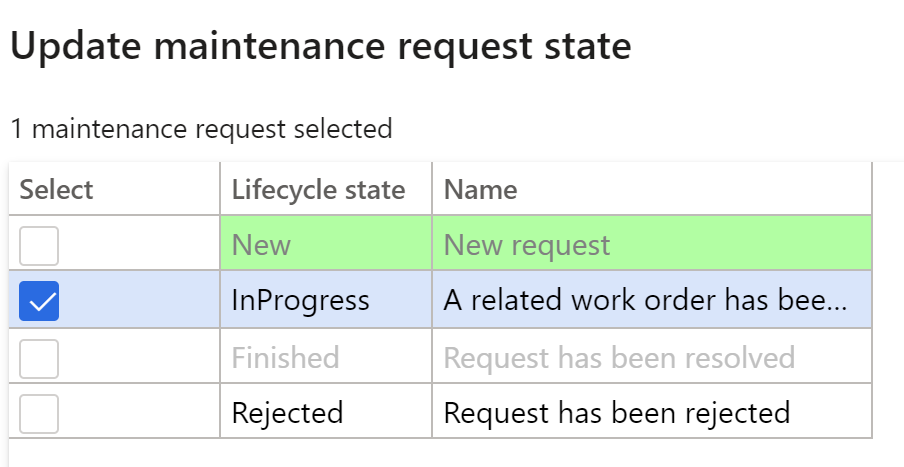

---
lab:
    title: 'Lab 7. Creare un ordine di lavoro di manutenzione'
    module: 'Modulo 1. Concetti fondamentali su Microsoft Dynamics 365 Supply Chain Management'
---

## Lab 7. Creare un ordine di lavoro di manutenzione

**Obiettivi**

Gli ordini di manutenzione inseriti nel sistema descrivono la manutenzione o la riparazione necessaria per un cespite e vengono usati per assegnare le risorse appropriate per completare la richiesta di manutenzione. L'ordine di lavoro viene creato in base all'ordine di manutenzione, che viene eseguito dalla risorsa allocata.

**Configurazione del lab**

Tempo stimato: 15 minuti.

**Istruzioni**

1. Nella home page Finance and Operations, in alto a destra, verificare di lavorare con la società USMF.

2. Se necessario, selezionare la società e scegliere **USMF** dal menu.

3. Nel riquadro di spostamento a sinistra selezionare **Moduli** **&gt; Gestione asset &gt; Configurazione &gt; Richiesta di intervento di manutenzione &gt; Stati del ciclo di vita**.

4. Selezionare InProgress e fare clic sul pulsante **Modifica** nel riquadro azioni.

5. Nella scheda **Generale** impostare il valore **Crea ordine di lavoro** su Sì.

6. Nel riquadro di spostamento a sinistra selezionare **Moduli** **&gt; Gestione asset &gt; Aree di lavoro &gt; Maintenance request management (Gestione richiesta di intervento di manutenzione)**.

7. Fare clic su **Create maintenance request (Crea richiesta di intervento di manutenzione)**.

8. Immettere i seguenti valori nei campi della finestra di dialogo e fare clic sul pulsante **OK**.

	- Tipo di richiesta di intervento di manutenzione: Correttiva

	- Descrizione: Rumore nel metal detector

	- Unità funzionale: PP-02-02

	- Cespite: MD-201

	- Livello di servizio: 4

	- Sintomo del guasto: Rumore eccessivo

	- Area del guasto: Impianto elettrico 

9. Chiudere il modulo **Richiesta di intervento di manutenzione** e tornare all'area di lavoro **Maintenance request management (Gestione richiesta di intervento di manutenzione)**.

10. Aggiornare la pagina premendo l'icona di **aggiornamento** nell'angolo in alto a destra dello schermo.

11. La nuova richiesta di intervento di manutenzione apparirà nell'elenco delle richieste di interventi di manutenzione senza ordine di lavoro.

12. Selezionare la nuova richiesta di intervento di manutenzione creata e fare clic sul pulsante **Update maintenance request state (Aggiorna stato richiesta di intervento di manutenzione)**. 

13. Nella finestra di dialogo selezionare la casella di controllo accanto a InProgress e fare clic su **OK**

 

14. Selezionare la nuova richiesta di manutenzione creata e fare clic sul pulsante **Crea ordine di lavoro**. 

15. Immettere i seguenti valori nei campi della finestra di dialogo e fare clic sul pulsante **OK**.

	- Tipo di processo di manutenzione: Ispezione

16. Verrà creato un nuovo ordine di lavoro e l'ordine di lavoro verrà aggiornato nel record della richiesta di intervento di manutenzione selezionato.

17. Fare clic sull'ordine di lavoro e passare alla schermata **Dettagli ordine di lavoro**.

18. Sotto le righe dell'ordine di lavoro fare clic sul pulsante **Spedisci**.

19. Immettere i seguenti valori nei campi della finestra di dialogo e fare clic sul pulsante **OK**.

	- Lavoratore: Ted Howard

20. Nel menu Azione passare a **Ordine di lavoro &gt; Stato del ciclo di vita &gt; Update work order state (Aggiorna stato ordine di lavoro)**.

21. Nella finestra di dialogo selezionare la casella di controllo accanto a InProgress e fare clic su **OK**

22. Selezionare la data e l'ora **Inizio effettivo** nella finestra di dialogo e fare clic su **OK.**

23. Dal menu Azione dell'ordine di lavoro passare nuovamente a **Ordine di lavoro &gt; Stato del ciclo di vita &gt; Update work order state (Aggiorna stato ordine di lavoro)**.

24. Nella finestra di dialogo selezionare la casella di controllo accanto a Completato e fare clic su **OK**

25. Nel campo **Fine effettiva** selezionare una data e un'ora successive alla data e all'ora di inizio e fare clic su OK

26. Lo stato corrente del ciclo di vita nell'intestazione dell'ordine di lavoro sarà indicato come completato.
