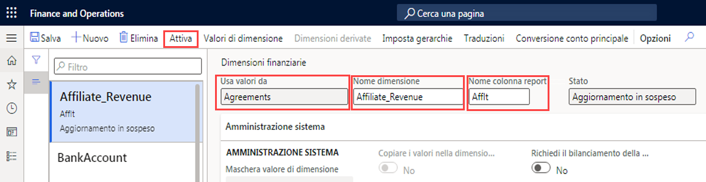
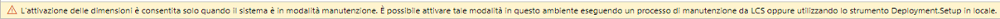

---
lab:
  title: 'Lab 1: Creare una dimensione finanziaria'
  module: 'Module 2: Learn the Fundamentals of Microsoft Dynamics 365 Finance'
ms.openlocfilehash: 9bbc1a92cb719b988ddfa6a08e1e3b2d8c69976e
ms.sourcegitcommit: 252458fca8e71b6e5e8b99ae4c2b47cd85461a30
ms.translationtype: HT
ms.contentlocale: it-IT
ms.lasthandoff: 01/27/2022
ms.locfileid: "137910030"
---
## Lab 1. Creare una dimensione finanziaria

## Obiettivi

Usare la pagina Dimensioni finanziarie per creare dimensioni finanziarie che è possibile usare come segmenti di conto per i piani dei conti. Esistono due tipi di dimensioni finanziarie: dimensioni personalizzate e dimensioni supportate da entità. Le dimensioni personalizzate sono condivise tra persone giuridiche e i valori vengono immessi e gestiti dagli utenti. Per le dimensioni supportate da entità, i valori vengono definiti in un'altra posizione nel sistema, ad esempio nelle entità Clienti o Punti vendita. Alcune dimensioni supportate da entità sono condivise tra persone giuridiche, mentre altre sono specifiche della società.

È necessario creare una dimensione finanziaria personalizzata che verrà usata dalla società.

## Configurazione del lab

   - **Tempo stimato**: 5 minuti

## Istruzioni

1. Nella home page Finance and Operations, in alto a destra, verificare di lavorare con la società USMF.

1. Se necessario, selezionare la società e scegliere **USMF** dal menu.

1. Nel riquadro di spostamento a sinistra selezionare **Moduli** > **Contabilità generale** > **Piano dei conti** > **Dimensioni** > **Dimensioni finanziarie**.

1. Nel menu superiore selezionare **+ Nuovo**.

1. Nella pagina Dimensioni finanziarie selezionare il menu **Usa valori da** e quindi selezionare **< Dimensione personalizzata >** .

1. Nella casella **Nome dimensione** immettere **Affliate_Revenue**.

1. Nella casella **Nome colonna report** immettere **Afflt**.

1. Nel menu in alto selezionare **Attiva**.

    

1. Esaminare le informazioni nella finestra di dialogo e quindi selezionare **Chiudi**.

1. Esaminare il banner di notifica di avviso.

    

    >[!NOTE] La modalità manutenzione può essere attivata e disattivata direttamente tramite Lifecycle Services (LCS) negli ambienti sandbox e di produzione. Altre informazioni sulla gestione di Lifecycle Services sono disponibili all'indirizzo [https://docs.microsoft.com/en-us/dynamics365/fin-ops-core/dev-itpro/deployment/maintenanceoperationsguide-newinfrastructure](https://docs.microsoft.com/en-us/dynamics365/fin-ops-core/dev-itpro/deployment/maintenanceoperationsguide-newinfrastructure).
