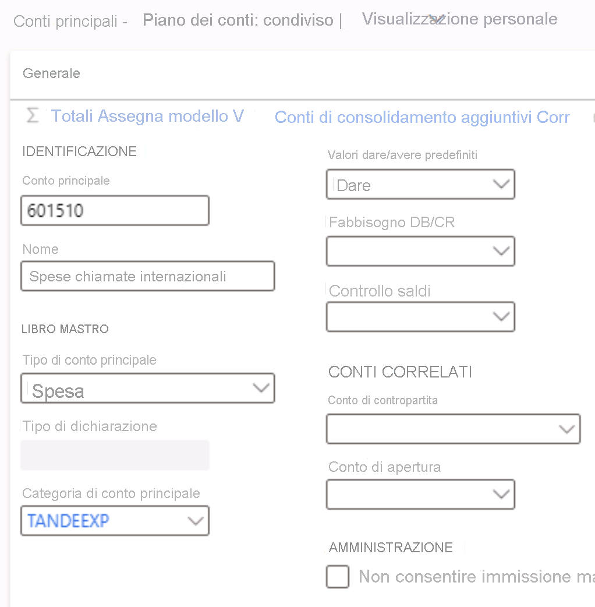

---
lab:
  title: 'Lab 1: Creare un conto principale'
  module: 'Module 2: Learn the Fundamentals of Microsoft Dynamics 365 Finance'
---

# Modulo 2. Learn the Fundamentals of Microsoft Dynamics 365 Finance

## Lab 1: Creare un conto principale

## Configurazione del lab

   - **Tempo stimato**: 5 minuti

## Istruzioni

1.  Nella home page **Finance and Operations** ,in alto a destra, verificare di lavorare con l'azienda **USMF** . 

2.  Se necessario, selezionare il selettore aziendale e scegliere **USMF**. 

3.  Nel riquadro di spostamento a sinistra, nel modulo **Generale ledger** selezionare **Grafico degli account** > **Account** > **Principali**.

4.  Selezionare **+ Nuovo** nel riquadro azioni.

5.  Immettere i valori seguenti nella pagina **Account principale** : 

    - Account principale: `601510`

    - Nome: `International call expense`

    - Tipo di account principale: `Expense`

    - Categoria dell'account principale: `TANDEEXP`

    - DB/CR predefinito: `Debit`

    

6.  Selezionare **Salva** e **chiudere** la pagina. 

