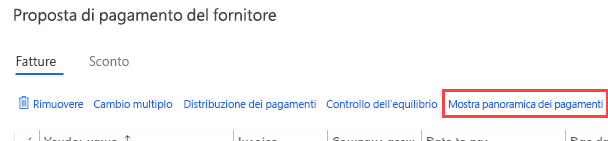
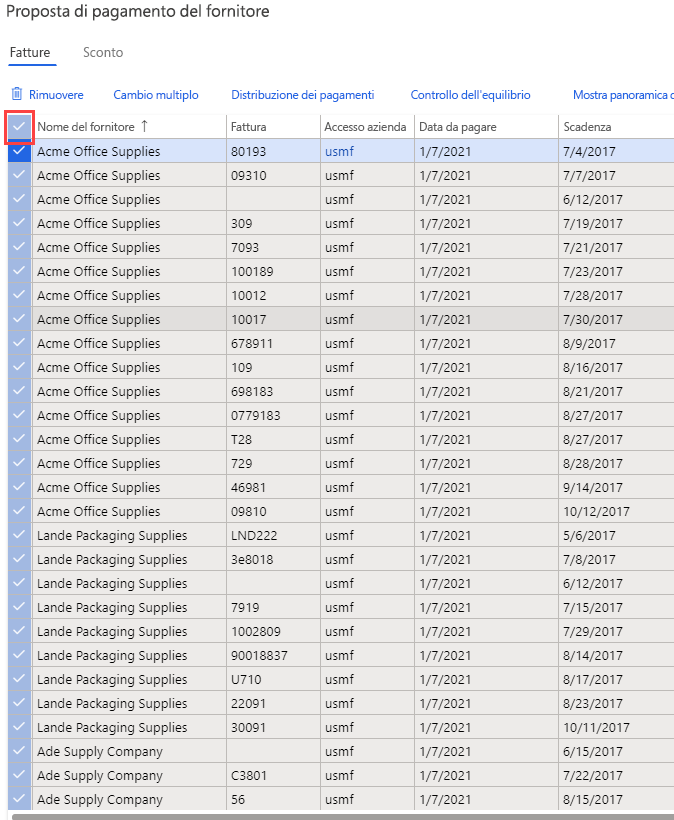
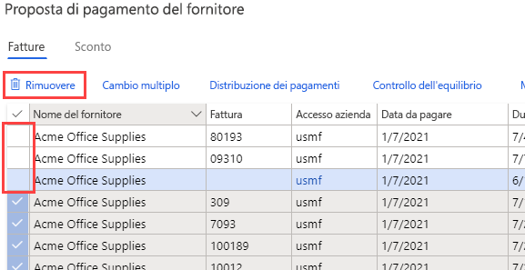

---
lab:
    title: 'Lab 2: Creare un giornale di registrazione pagamenti fornitore'
    module: 'Modulo 2: Concetti fondamentali su Microsoft Dynamics 365 Finance'
---

## Lab 2: Creare un giornale di registrazione pagamenti fornitore

## Obiettivi

Le organizzazioni che pagano i in base a una pianificazione ricorrente possono ora automatizzare il processo di generazione di proposte di pagamento fornitore. Le automazioni delle proposte di pagamento fornitore definiscono i dettagli seguenti:

- Quando vengono eseguite le proposte di pagamento
- Quali criteri vengono usati per selezionare le fatture da pagare
- In quale giornale di registrazione pagamenti fornitore vengono salvati i pagamenti risultanti

Le automazioni delle proposte di pagamento non registrano automaticamente i pagamenti. È quindi possibile continuare a usare i processi del flusso di lavoro e di convalida attualmente in uso per approvare i pagamenti creati.

Creare una nuova scrittura contabile nel giornale di registrazione pagamenti fornitore e una proposta di pagamento.

## Configurazione del lab

   - **Tempo stimato**: 10 minuti

## Istruzioni

1. Nella home page Finance and Operations, in alto a destra, verificare di lavorare con la società USMF.

1. Se necessario, selezionare la società e scegliere **USMF** dal menu.

1. Nel pannello di navigazione a sinistra selezionare **Moduli** > **Contabilità fornitori** > **Pagamenti** > **Giornale di registrazione pagamenti fornitore**.

1. Nel menu superiore selezionare **+ Nuovo**.

1. Osservare il nuovo Numero batch giornale di registrazione creato.

1. Nella casella **Nome** immettere **Vend** e quindi selezionare **VendPay** nell'elenco filtrato.

1. Nel menu in alto selezionare **Righe**.

1. Nella pagina Pagamenti fornitore, nel menu in alto selezionare **Proposta di pagamento** > **Crea proposta di pagamento**.  
    La proposta di pagamento è una query usata per selezionare le fatture per il pagamento. È possibile modificare l'elenco delle fatture da pagare prima di creare o generare i pagamenti fornitore.

    

1. Nel riquadro Proposta pagamento fornitore, in **CRITERI DI SELEZIONE FATTURE** selezionare il menu **Selezionare le fatture in base a**, esaminare le opzioni disponibili e quindi selezionare **Scadenza**.

1. In **Dal** e **Al** eliminare i valori esistenti. Per questo esercizio gli intervalli di date verranno lasciati vuoti.

    >[!NOTA] È possibile usare una data di pagamento minima come data di pagamento. La data di pagamento minima è la prima data possibile da usare quando si creano pagamenti. Se, ad esempio, una fattura ha una scadenza successiva alla data di pagamento minima, la scadenza diventa la data di pagamento al posto della data di pagamento minima in modo da pagare la fattura nell'ultima data possibile.

1. Espandere **Record da includere** e quindi esaminare le opzioni.  
    Il filtro viene spesso usato per limitare le fatture selezionate per il pagamento in base al gruppo di fornitori o al metodo di pagamento. È ad esempio possibile aggiungere un filtro per pagare le fatture solo con assegno per il ciclo di pagamenti in corso.

1. Espandere **Parametri avanzati** e quindi esaminare le opzioni disponibili.  
    È possibile usare i parametri aggiuntivi per definire la valuta del pagamento o per consentire i pagamenti centralizzati per il ciclo di pagamenti in corso.

1. Selezionare **OK**.  
    Dopo aver selezionato OK, verranno visualizzati i risultati della query. Se non si vuole visualizzare l'anteprima dell'elenco di fatture selezionate per il pagamento, tornare alla Scheda dettaglio Parametri e modificare l'impostazione **Crea pagamenti senza anteprima fattura** su **Sì**.

1. Nella finestra Proposta pagamento fornitore selezionare **Mostra panoramica pagamenti** per visualizzare i pagamenti che verranno creati per il fornitore per la fattura selezionata.

    

1. Nel menu selezionare **Nascondi panoramica pagamenti** per nascondere i pagamenti.

1. Selezionare l'icona a forma di segno di spunta a sinistra dell'intestazione di colonna **Nome fornitore** per selezionare tutte le fatture.

    

1. Deselezionare la casella di controllo per le prime tre fatture e quindi scegliere **Rimuovi** dal menu per rimuovere tutte le altre fatture.

    

1. Nella finestra di dialogo selezionare **Sì**.

1. Esaminare le tre fatture rimanenti.

1. Per esportare l'elenco di fatture in Excel, fare clic con il pulsante destro del mouse sulla griglia e scegliere un'opzione di esportazione.

1. Nell'angolo in basso a destra selezionare **Crea pagamenti** per creare i pagamenti fornitore nel giornale di registrazione pagamenti.

1. Esaminare l'elenco di pagamenti fornitore.
