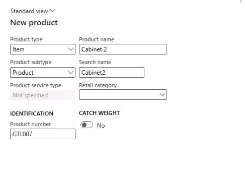

---
lab:
  title: 'Lab 1: Creare un nuovo prodotto'
  module: 'Module 3: Learn the Fundamentals of Microsoft Dynamics 365 Supply Chain Management'
---

# Modulo 3: Informazioni fondamentali sulla gestione della supply chain di Microsoft Dynamics 365

## Lab 1: Creare un nuovo prodotto

## Obiettivo

In Contoso Entertainment System USA (USMF) si prevede di acquistare una nuova configurazione di cabinet da un fornitore. È necessario creare un elemento che rappresenti la nuova configurazione. Questo lab descrive come creare un nuovo elemento e la relativa configurazione.

## Configurazione del lab

   - **Tempo** stimato: 10 minuti

## Istruzioni

In Contoso Entertainment System USA (USMF) si prevede di acquistare una nuova configurazione di cabinet da un fornitore. È necessario creare un elemento che rappresenti la nuova configurazione.

1.  Nella home page delle app per la finanza e le operazioni, in alto a destra verificare che la società in uso sia **USMF**. Se necessario, nell'elenco a discesa della società, selezionare **USMF**.

2.  In alto a sinistra selezionare il menu a forma di hamburger **Espande il riquadro di spostamento**.

3.  Nel riquadro di spostamento selezionare **Moduli**, quindi scegliere **Gestione informazioni sul prodotto**. Nel menu **Prodotti** selezionare **Prodotti**.

4.  Nella pagina **Prodotti**, nel menu in alto selezionare **+ Nuovo**.

5.  Nella pagina **Nuovo prodotto**, nel campo **Tipo di prodotto** verificare che sia selezionato **Articolo**.

6.  Nel campo **Sottotipo di prodotto** verificare che sia selezionato **Prodotto**.

7.  Sotto **IDENTIFICAZIONE** nella casella **Numero prodotto** immettere **GTL007**.

8.  Nella casella **Nome prodotto** immettere **Cabinet 2**.

    

9.  Selezionare il pulsante **OK**.

10. Nel menu **Prodotto** del riquadro Azioni, nel gruppo **Imposta** selezionare **Gruppi di dimensioni**.

    

11. Selezionare l'elenco a discesa **Gruppo di dimensioni di immagazzinamento**, quindi selezionare **SiteWH**.

12. Selezionare l'elenco a discesa del campo **Gruppo di dimensioni di tracciabilità**, quindi selezionare **Nessuno**.

13. Selezionare il pulsante **OK**.

14. Selezionare il pulsante **Rilascia prodotti** nel riquadro Azioni per rilasciare il prodotto in una persona giuridica.

15. Viene visualizzata una pagina che mostra il primo passaggio come **Seleziona i prodotti da rilasciare**.

    

16. Selezionare il pulsante **Avanti** nella parte inferiore della pagina.

17. Nella pagina **Seleziona società cui effettuare il rilascio** selezionare la persona giuridica **USMF** in cui il prodotto deve essere rilasciato.

18. Selezionare il pulsante **Avanti** nella parte inferiore della pagina.

19. Nella pagina **Conferma selezione** impostare il valore di **Mostra registro informazioni in caso di errori** su **Sì** e di **Esegui come batch** su **No.**.

20. Selezionare il pulsante **Fine** nella parte inferiore della pagina.

21. Nel riquadro di spostamento selezionare Moduli, quindi scegliere Gestione informazioni sul prodotto. Nel menu Prodotti selezionare i prodotti **Rilasciati**.

22. Nella **pagina Prodotti** rilasciati** **individuare il nuovo elemento **GTL007** nella griglia. 

23. Selezionare il collegamento al prodotto e spostarsi sulla pagina **Dettagli prodotto**.

24. Nella Scheda dettaglio **Generale** immettere le informazioni seguenti:

    - **Gruppo di modelli di articoli**: FIFO

25. Nella Scheda dettaglio **Acquisto** immettere le informazioni seguenti:

    - **Unità**: ea

    - **Fascia IVA articoli**: TUTTO

    - **Prezzo**: 30

26. Nella Scheda dettaglio **Vendita** immettere le informazioni seguenti:

    - **Unità**: ea

    - **Fascia IVA articoli**: TUTTO

    - **Prezzo**: 35

27. Nella Scheda dettaglio **Gestione articoli** immettere le informazioni seguenti:

    - **Unità**: ea

28. Nella Scheda dettaglio **Progetta** immettere le informazioni seguenti:

    - **Unità DBA**: ea

29. Nella Scheda dettaglio **Gestione costi** immettere le informazioni seguenti:

    - **Gruppo articoli**: audio

30. Per completare la configurazione, selezionare Prodotto nel riquadro Azioni. Selezionare il pulsante Convalida nel gruppo Gestisci

    

31. Verificare che sia visualizzato il banner informativo in cui si conferma che tutti i valori dei campi richiesti sono stati convalidati.

    

32. Chiudere tutte le pagine e tornare alla home page.
